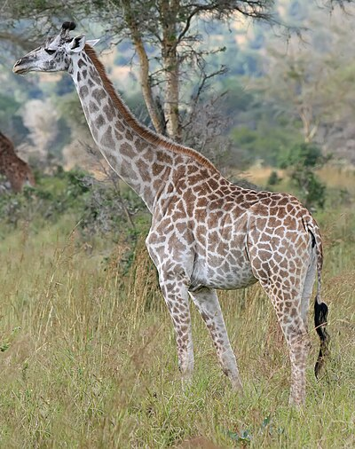

# Bank Soal Sumatif Tengah Semester (STS) Genap
## Kelas 2 - Semua Paket

### A. Pilihan Ganda (Multiple Choice)
Pilihlah jawaban yang paling tepat!

1. My name is Rina. ___ am a student.
   a. He
   b. She
   c. I <!--correct-->
   d. They

2. Look at Mr. Ahmad. ___ is my teacher.
   a. I
   b. He <!--correct-->
   c. She
   d. It

3. "This is my mother. ___ is very kind." The correct pronoun is ...
   a. He
   b. She <!--correct-->
   c. It
   d. You

4. My grandfather is 80 years old. He is ___.
   a. Young
   b. Old <!--correct-->
   c. Short
   d. Tall

5. My father's father is my ___.
   a. Uncle
   b. Brother
   c. Grandfather <!--correct-->
   d. Father

6. My father's brother is my ___.
   a. Aunt
   b. Uncle <!--correct-->
   c. Cousin
   d. Grandfather

7. My father's sister is my ___.
   a. Aunt <!--correct-->
   b. Uncle
   c. Mother
   d. Sister

8. The giraffe has a ___ neck.
   
   a. Short
   b. Long/Tall <!--correct-->
   c. Thin
   d. Small

9. Ant is small, but elephant is ___.
   
   a. Thin
   b. Big <!--correct-->
   c. Short
   d. Tiny

10. Look at the ruler. It is 30 cm. It is ___.
    a. Short
    b. Long <!--correct-->
    c. Fat
    d. Old

11. Rearrange the letters: T-A-L-L. The correct word is ___.
    a. Tall <!--correct-->
    b. Llat
    c. Tlla
    d. Altl

12. Rearrange the letters: S-M-A-R-T. The correct word is ___.
    a. Smart <!--correct-->
    b. Strat
    c. Msart
    d. Traps

13. This is Maria. ___ is beautiful.
    a. He
    b. I
    c. She <!--correct-->
    d. It

14. "I have a new doll. It is very ___." (bagus/cantik)
    a. Ugly
    b. Pretty <!--correct-->
    c. Angry
    d. Sad

15. My father and my mother are my ___.
    a. Grandparents
    b. Parents <!--correct-->
    c. Children
    d. Friends

### B. Isian / Uraian (Fill-in-the-blanks / Essay)
Isilah titik-titik di bawah ini dengan jawaban yang benar!

1. Mention three members of a nuclear family! <!--correct:Father, Mother, Brother/Sister-->
2. Translate "Old" into Bahasa Indonesia! <!--correct:Tua-->
3. Translate "Pintar" into English! <!--correct:Smart / Clever-->
4. Arrange: is - My - small - house. <!--correct:My house is small.-->
5. Is an elephant small? <!--correct:No, it is big.-->
6. "T-H-I-N" spell as ... <!--correct:Thin-->

### A. Pilihan Ganda (Multiple Choice)
Pilihlah jawaban yang paling tepat!

1. This is my friend, Leo. ___ is a smart boy.
   a. She
   b. I
   c. He <!--correct-->
   d. It

2. "My mother is a doctor. ___ works in a hospital."
   a. He
   b. She <!--correct-->
   c. I
   d. They

3. The elephant is big, but the mouse is ___.
   a. Small <!--correct-->
   b. Tall
   c. Fat
   d. Old

4. My father's mother is my ___.
   a. Grandfather
   b. Grandmother <!--correct-->
   c. Aunt
   d. Sister

5. My mother's brother is my ___.
   a. Uncle <!--correct-->
   b. Aunt
   c. Cousin
   d. Father

6. Look at the giraffe! It has a ___ neck.
   a. Short
   b. Long <!--correct-->
   c. Thin
   d. Fat

7. My sister is my parent's ___.
   a. Son
   b. Daughter <!--correct-->
   c. Brother
   d. Uncle

8. "I have a new bike. ___ is blue."
   a. He
   b. She
   c. It <!--correct-->
   d. They

9. A dictionary is thick, but a notebook is ___.
   a. Thick
   b. Thin <!--correct-->
   c. Big
   d. Old

10. My father's sister is my ___.
    a. Aunt <!--correct-->
    b. Uncle
    c. Grandmother
    d. Mother

11. Rearrange the letters: O-L-D. The correct word is ___.
    a. Old <!--correct-->
    b. Dol
    c. Ldo
    d. Odl

12. Rearrange the letters: G-O-O-D. The correct word is ___.
    a. Doog
    b. Good <!--correct-->
    c. Odog
    d. Gdoo

13. This is Rino. ___ is my brother.
    a. She
    b. He <!--correct-->
    c. I
    d. It

14. The cat is small, but the tiger is ___.
    a. Small
    b. Big <!--correct-->
    c. Thin
    d. Short

15. My brother and I are my parent's ___.
    a. Children <!--correct-->
    b. Grandparents
    c. Friends
    d. Teachers

### B. Isian / Uraian (Fill-in-the-blanks / Essay)
Isilah titik-titik di bawah ini dengan jawaban yang benar!

1. Mention two members of your family! <!--correct:Father, Mother / Brother, Sister (any 2)-->
2. Translate "Young" into Bahasa Indonesia! <!--correct:Muda-->
3. Translate "Cantik" into English! <!--correct:Beautiful / Pretty-->
4. Arrange: My - is - mother - kind. <!--correct:My mother is kind.-->
5. Is an ant big? <!--correct:No, it is small.-->

### A. Pilihan Ganda (Multiple Choice)
Pilihlah jawaban yang paling tepat!

1. "Look at the stars. ___ are very beautiful."
   a. He
   b. She
   c. It
   d. They <!--correct-->

2. "This is Maria. ___ is my best friend."
   a. He
   b. She <!--correct-->
   c. I
   d. It

3. The ruler is long, but the pencil is ___.
   a. Short <!--correct-->
   b. Long
   c. Big
   d. Fat

4. My father's father is my ___.
   a. Grandmother
   b. Grandfather <!--correct-->
   c. Uncle
   d. Brother

5. My mother's sister is my ___.
   a. Uncle
   b. Aunt <!--correct-->
   c. Cousin
   d. Sister

6. The sumo wrestler is fat, but the runner is ___.
   a. Fat
   b. Thin <!--correct-->
   c. Old
   d. Big

7. My brother is my parent's ___.
   a. Daughter
   b. Son <!--correct-->
   c. Sister
   d. Aunt

8. "I have a cat. ___ is very cute."
   a. He
   b. She
   c. It <!--correct-->
   d. They

9. Grandfather is old, but the baby is ___.
   a. Old
   b. Young <!--correct-->
   c. Big
   d. Tall

10. My aunt's son is my ___.
    a. Brother
    b. Sister
    c. Cousin <!--correct-->
    d. Uncle

11. Rearrange the letters: K-I-N-D. The correct word is ___.
    a. Kind <!--correct-->
    b. Dnik
    c. Idnk
    d. Ndik

12. Rearrange the letters: F-A-S-T. The correct word is ___.
    a. Fats
    b. Fast <!--correct-->
    c. Tsfa
    d. Satf

13. This is Mr. Wilson. ___ is my teacher.
    a. She
    b. He <!--correct-->
    c. I
    d. It

14. The building is tall, but the house is ___.
    a. Tall
    b. Short <!--correct-->
    c. Big
    d. Fat

15. Father, mother, and children are a ___.
    a. School
    b. Family <!--correct-->
    c. Class
    d. Team

### B. Isian / Uraian (Fill-in-the-blanks / Essay)
Isilah titik-titik di bawah ini dengan jawaban yang benar!

1. Who is your father's brother? <!--correct:Uncle-->
2. Translate "Short" into Bahasa Indonesia! <!--correct:Pendek-->
3. Translate "Pintar" into English! <!--correct:Smart / Clever-->
4. Arrange: is - My - father - tall. <!--correct:My father is tall.-->
5. Are you a student? <!--correct:Yes, I am.-->
