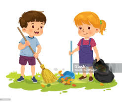

# Bank Soal Sumatif Tengah Semester (STS) Genap
## Kelas 2 - Semua Paket

### A. Pilihan Ganda
Pilihlah jawaban yang paling tepat!

1. Keterangan diri seperti nama, alamat, dan tanggal lahir disebut ...
   a. Cerita pendek
   b. Identitas diri <!--correct-->
   c. Silsilah
   d. Dokumen negara

2. Untuk mengetahui kapan seseorang lahir, kita dapat melihat dokumen ...
   a. Kartu Pelajar
   b. Akta Kelahiran <!--correct-->
   c. Majalah
   d. Koran

3. Alamat rumah Budi di Jalan Mawar No. 10. Alamat berguna agar ...
   a. Rumah menjadi besar
   b. Orang mudah mencari lokasi rumah <!--correct-->
   c. Rumah menjadi bersih
   d. Kita punya banyak teman

4. Dokumen yang berisi daftar anggota keluarga dalam satu rumah adalah ...
   a. Akta Kelahiran
   b. Kartu Keluarga (KK) <!--correct-->
   c. Rapor
   d. Sertifikat

5. Perhatikan gambar fisik anak ini.
   
   Ciri fisik yang tampak pada gambar adalah ...
   a. Rambut lurus<!--correct-->
   b. Rambut keriting 
   c. Badan gemuk
   d. Mata biru

6. Dokumen pribadi yang didapat setelah kita lulus atau selesai ujian sekolah adalah ...
   a. Akta Kelahiran
   b. Ijazah atau Rapor <!--correct-->
   c. KTP
   d. SIM

7. Setiap warga negara yang sudah berusia 17 tahun wajib memiliki ...
   a. Kartu Keluarga
   b. KTP <!--correct-->
   c. Akta Kelahiran
   d. Kartu Pelajar

8. Ayah dari ayah atau ibu kita disebut ...
   a. Paman
   b. Kakek <!--correct-->
   c. Kakak
   d. Bibi

9. Saudara perempuan dari ayah atau ibu kita disebut ...
   a. Paman
   b. Bibi <!--correct-->
   c. Nenek
   d. Sepupu

10. Adik laki-laki dari ayah atau ibu kita sapa dengan sebutan ...
    a. Paman <!--correct-->
    b. Bibi
    c. Kakek
    d. Kakak

11. Anak dari paman atau bibi kita disebut saudara ...
    a. Kandung
    b. Sepupu <!--correct-->
    c. Kembar
    d. Jauh

12. Tugas utama seorang Ayah sebagai kepala keluarga adalah ...
    a. Main game
    b. Mencari nafkah dan memimpin keluarga <!--correct-->
    c. Hanya tidur
    d. Menonton TV

13. Tugas utama seorang anak di rumah adalah ...
    a. Mencari uang
    b. Membantu orang tua dan belajar <!--correct-->
    c. Bermain seharian tanpa belajar
    d. Tidur sepanjang hari

14. Jika rumah kotor, yang harus dilakukan anggota keluarga adalah ...
    a. Membiarkannya
    b. Menunggu ibu saja
    c. Bekerja sama membersihkannya <!--correct-->
    d. Pergi bermain ke luar

15. Peristiwa menyenangkan dalam keluarga contohnya adalah ...
    a. Sakit demam
    b. Merayakan ulang tahun bersama <!--correct-->
    c. Kehilangan mainan
    d. Jatuh dari sepeda

### B. Benar atau Salah
Berilah tanda (B) jika benar dan (S) jika salah!

16. Rapor adalah dokumen yang mencatat hasil belajar siswa. (___) <!--correct:B-->
17. Kita tidak perlu tahu alamat rumah sendiri. (___) <!--correct:S-->
18. Merawat anggota keluarga yang sakit adalah wujud kasih sayang. (___) <!--correct:B-->
19. Silsilah membantu kita mengenal hubungan antar anggota keluarga. (___) <!--correct:B-->
20. Anak boleh membantah perintah orang tua yang baik. (___) <!--correct:S-->

### C. Isian
Isilah dengan jawaban yang benar!

21. Sebutkan dokumen yang dibuat saat bayi baru lahir! <!--correct:Akta Kelahiran-->
22. "Mojokerto, 17 Agustus 2017". Nama kota tersebut menunjukkan ... lahir. <!--correct:Tempat-->
23. Ibu dari ayah atau ibu kita disebut ... <!--correct:Nenek-->
24. Bekerja bersama-sama membuat pekerjaan berat menjadi ... <!--correct:Ringan-->
25. Perhatikan gambar berikut.
    
    Kegiatan pada gambar disebut kerja ... <!--correct:Bakti / Kerja Sama-->

### A. Pilihan Ganda
Pilihlah jawaban yang paling tepat!

1. Hal pertama yang kita sebutkan saat berkenalan adalah ...
   a. Alamat rumah
   b. Nama lengkap <!--correct-->
   c. Warna kesukaan
   d. Nama kucing

2. Dokumen yang membuktikan identitas kita sebagai warga negara dewasa adalah ...
   a. Akta Kelahiran
   b. KTP <!--correct-->
   c. Rapor
   d. Kartu Perpustakaan

3. Jika kita tersesat, hal penting yang harus kita hafal adalah ...
   a. Judul film
   b. Alamat rumah sendiri <!--correct-->
   c. Nama teman sebangku
   d. Harga es krim

4. Dokumen yang menunjukkan silsilah atau susunan keluarga besar adalah ...
   a. Akta Kelahiran
   b. Kartu Keluarga (KK) <!--correct-->
   c. Rapor
   d. SIM

5. Ciri fisik yang membedakan satu orang dengan orang lain contohnya adalah ...
   a. Nama panggilannya
   b. Warna kulit dan bentuk rambut <!--correct-->
   c. Jenis makanan favorit
   d. Merek sepatu

6. Dokumen yang diberikan kepada bayi sebagai tanda kelahiran adalah ...
   a. Paspor
   b. Akta Kelahiran <!--correct-->
   c. KTP
   d. Kartu Pelajar

7. Setiap anggota keluarga memiliki perannya masing-masing. Peran Ibu biasanya ...
   a. Bermain bola
   b. Mengurus rumah tangga dan mendidik anak <!--correct-->
   c. Mencari nafkah saja
   d. Belajar di sekolah

8. Orang tua dari ayah atau ibu kita disebut ...
   a. Paman
   b. Kakek dan Nenek <!--correct-->
   c. Kakak
   d. Bibi

9. Saudara laki-laki dari ayah atau ibu kita disebut ...
   a. Bibi
   b. Paman <!--correct-->
   c. Kakek
   d. Sepupu

10. Saudara kandung laki-laki yang lebih tua dari kita disebut ...
    a. Kakak <!--correct-->
    b. Adik
    c. Paman
    d. Bibi

11. Kerja bakti di rumah membuat pekerjaan membersihkan rumah menjadi ...
    a. Semakin lama
    b. Lebih ringan dan cepat selesai <!--correct-->
    c. Membosankan
    d. Sangat sulit

12. Contoh kerja sama di rumah adalah ...
    a. Belajar sendirian
    b. Membantu ibu mencuci piring <!--correct-->
    c. Tidur saat ayah menyapu
    d. Membuang sampah sembarangan

13. Tanggung jawab anak terhadap orang tua adalah ...
    a. Meminta uang terus
    b. Patuh dan hormat <!--correct-->
    c. Marah-marah
    d. Tidak mau belajar

14. Peristiwa sedih dalam keluarga contohnya adalah ...
    a. Menang lomba
    b. Anggota keluarga yang sakit <!--correct-->
    c. Makan bersama
    d. Liburan ke pantai

15. Silsilah keluarga biasanya digambarkan dalam bentuk ...
    a. Kotak makanan
    b. Bagan atau pohon keluarga <!--correct-->
    c. Lingkaran warna
    d. Garis lurus saja

### B. Benar atau Salah
Berilah tanda (B) jika benar dan (S) jika salah!

16. Nama panggilan adalah bagian dari identitas diri. (___) <!--correct:B-->
17. Kartu Keluarga hanya berisi nama ayah saja. (___) <!--correct:S-->
18. Membantu menyapu halaman adalah contoh kerja sama di rumah. (___) <!--correct:B-->
19. Kita tidak perlu menghormati orang yang lebih tua. (___) <!--correct:S-->
20. Identitas diri membantu orang lain mengenal kita. (___) <!--correct:B-->

### C. Isian
Isilah dengan jawaban yang benar!

21. Sebutkan dokumen yang harus dibawa saat mendaftar sekolah! <!--correct:Akta Kelahiran / KK / Ijazah-->
22. "Surabaya, 10 Januari 2017". Angka 2017 menunjukkan ... lahir. <!--correct:Tahun-->
23. Ayah dari ayah kita disebut ... <!--correct:Kakek-->
24. Sebutan untuk anak dari paman adalah ... <!--correct:Sepupu-->
25. Jika pekerjaan dilakukan bersama-sama disebut ... <!--correct:Kerja Sama / Gotong Royong-->

### A. Pilihan Ganda
Pilihlah jawaban yang paling tepat!

1. Identitas diri dapat ditemukan dalam kartu yang dibawa siswa, yaitu ...
   a. Kartu Undangan
   b. Kartu Pelajar <!--correct-->
   c. Kartu Ucapan
   d. Kartu Remi

2. Tempat kelahiran Budi adalah Kota Mojokerto. Kalimat tersebut menunjukkan ...
   a. Nama orang
   b. Tempat lahir <!--correct-->
   c. Tanggal lahir
   d. Hobi

3. Mengapa kita perlu menyimpan dokumen penting (seperti Akta) di tempat aman?
   a. Agar cepat rusak
   b. Agar tidak hilang atau kotor <!--correct-->
   c. Agar bisa dimainkan
   d. Agar berat

4. Di dalam Kartu Keluarga (KK), orang yang menjadi "Kepala Keluarga" adalah ...
   a. Kakak
   b. Ayah <!--correct-->
   c. Adik
   d. Nenek

5. Reno berambut lurus, dahi lebar, dan kulit kuning langsat. Hal ini disebut ciri ...
   a. Identitas
   b. Fisik <!--correct-->
   c. Sifat
   d. Alamat

6. Ijazah adalah dokumen yang didapat setelah ...
   a. Membeli buku
   b. Menyelesaikan pendidikan atau lulus <!--correct-->
   c. Ulang tahun
   d. Main ke sekolah

7. Adik perempuan dari ayah atau ibu kita disebut ...
   a. Paman
   b. Bibi <!--correct-->
   c. Nenek
   d. Kakak

8. Ibu dari ayah atau ibu kita disebut ...
   a. Kakek
   b. Nenek <!--correct-->
   c. Bibi
   d. Kakak

9. Saudara kandung laki-laki atau perempuan yang lahir bersamaan disebut saudara ...
   a. Kandung
   b. Kembar <!--correct-->
   c. Sepupu
   d. Tiri

10. Sebutan untuk anak-anak dalam keluarga adalah ...
    a. Orang tua
    b. Buah hati / Anak <!--correct-->
    c. Paman
    d. Kakek

11. Gotong royong membersihkan selokan di depan rumah termasuk kerja sama di lingkungan ...
    a. Sekolah
    b. Rumah / Tetangga <!--correct-->
    c. Pasar
    d. Kantor

12. Manfaat kerja sama di keluarga adalah mempererat ...
    a. Permusuhan
    b. Keakraban dan kasih sayang <!--correct-->
    c. Jarak antar rumah
    d. Masalah

13. Menyiapkan peralatan sekolah sendiri adalah contoh kemandirian dan tanggung jawab ...
    a. Ayah
    b. Anak <!--correct-->
    c. Ibu
    d. Nenek

14. Peristiwa yang membuat bangga keluarga contohnya adalah ...
    a. Menjadi juara kelas <!--correct-->
    b. Dimarahi guru
    c. Merusakkan mainan adik
    d. Malas belajar

15. Hubungan silsilah: "Ayah memiliki adik laki-laki, maka adik ayah itu adalah ___ saya."
    a. Bibi
    b. Paman <!--correct-->
    c. Kakek
    d. Sepupu

### B. Benar atau Salah
Berilah tanda (B) jika benar dan (S) jika salah!

16. Nama orang tua tidak termasuk identitas diri kita. (___) <!--correct:S-->
17. Akta Kelahiran memuat nama ayah dan ibu. (___) <!--correct:B-->
18. Anak bertugas mencari nafkah untuk keluarga. (___) <!--correct:S-->
19. Kerja sama membuat pekerjaan terasa lebih berat. (___) <!--correct:S-->
20. Kita harus menyayangi seluruh anggota keluarga. (___) <!--correct:B-->

### C. Isian
Isilah dengan jawaban yang benar!

21. Akta Kelahiran disimpan agar tidak ... <!--correct:Rusak / Hilang-->
22. Kartu Keluarga menunjukkan siapa saja anggota ... kita. <!--correct:Keluarga-->
23. Sebutan paman untuk adik laki-laki Ibu dalam bahasa daerahmu adalah ... <!--correct:Om / Paklik / Paman (apapun yang relevan)-->
24. Membantu ibu mencuci sayur adalah bentuk ... <!--correct:Kerja Sama / Bantuan-->
25. Silsilah keluarga dimulai dari yang paling ... (Kakek/Nenek). <!--correct:Tua / Atas-->
