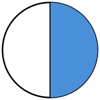
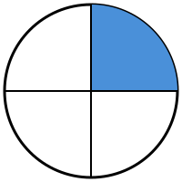
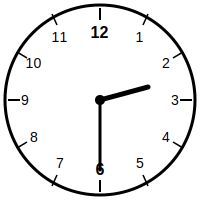

# Bank Soal Sumatif Tengah Semester (STS) Genap
## Kelas 2 - Semua Paket

### A. Pilihan Ganda
Pilihlah jawaban yang paling tepat!

1. Manakah gambar yang menunjukkan pecahan 1/2 (setengah)?
   
   a. Lingkaran dibagi 4 bagian, 1 arsir
   b. Persegi dibagi 2 bagian sama besar, 1 arsir <!--correct-->
   c. Segitiga dibagi 3 tidak sama besar
   d. Kotak utuh

2. Pecahan 1/3 dibaca ...
   a. Setengah
   b. Sepertiga <!--correct-->
   c. Seperempat
   d. Satu tiga

3. Gambar yang menunjukkan pecahan 1/4 (seperempat) adalah ...
   
   a. Lingkaran dibagi 4 bagian sama besar, 1 arsir <!--correct-->
   b. Persegi dibagi 2 bagian
   c. Segitiga dibagi 3 bagian
   d. Satu kotak utuh

4. Ibu memotong semangka menjadi 4 bagian sama besar. 1 bagian diberikan ke Adik. Bagian Adik adalah ...
   a. 1/2
   b. 1/3
   c. 1/4 <!--correct-->
   d. 1/1

5. Doni memiliki 1 roti, dibagi 2 sama besar untuk dirinya dan temannya. Berapa bagian temannya?
   a. 1/2 <!--correct-->
   b. 1/3
   c. 1/4
   d. 4/1

6. Pecahan "Sepertiga" ditulis dengan lambang ...
   a. 1/2
   b. 1/3 <!--correct-->
   c. 1/4
   d. 3/1

7. Benda manakah yang paling berat?
   a. Kapas satu genggam
   b. Sebuah buku tulis
   c. Lemari kayu besar <!--correct-->
   d. Sebuah pensil

8. Berat 1 buah semangka ___ daripada 1 buah jeruk.
   a. Lebih ringan
   b. Sama berat
   c. Lebih berat <!--correct-->
   d. Lebih sedikit

9. Berat sebuah penghapus ___ daripada sebuah tas sekolah.
   a. Lebih ringan <!--correct-->
   b. Lebih berat
   c. Sama berat
   d. Lebih besar

10. Hari ini adalah hari Senin. Besok adalah hari ...
    a. Minggu
    b. Selasa <!--correct-->
    c. Rabu
    d. Sabtu

11. Kemarin adalah hari Rabu. Hari ini adalah hari ...
    a. Selasa
    b. Kamis <!--correct-->
    c. Jumat
    d. Senin

12. Bulan setelah bulan April adalah bulan ...
    a. Maret
    b. Mei <!--correct-->
    c. Juni
    d. Juli

13. Jarum pendek menunjuk ke angka 9, jarum panjang menunjuk ke angka 12. Pukul ...
    a. 09.00 <!--correct-->
    b. 12.00
    c. 03.00
    d. 06.00

14. Jarum pendek di antara angka 4 dan 5, jarum panjang di angka 6. Pukul ...
    a. 04.00
    b. 05.00
    c. 04.30 <!--correct-->
    d. 06.20

15. Perhatikan gambar jam berikut!
    
    Waktu tersebut menunjukkan pukul ...
    a. 02.00
    b. 02.30 <!--correct-->
    c. 03.00
    d. 06.15

### B. Benar atau Salah
Tentukan apakah pernyataan berikut Benar (B) atau Salah (S)!

16. Satu buah apel dibagi 2 sama besar disebut sepertiga. (___) <!--correct:S-->
17. Gambar lingkaran dibagi 4 sama besar dan 1 bagian diarsir adalah 1/4. (___) <!--correct:B-->
18. Kegiatan "Makan" biasanya lebih lama daripada kegiatan "Liburan". (___) <!--correct:S-->
19. Urutan benda dari ringan: Bulu ayam -> Apel -> Batu bata. (___) <!--correct:B-->
20. Jika Budi mulai belajar pukul 07.00 dan selesai pukul 09.00, maka lama belajarnya 2 jam. (___) <!--correct:B-->

### C. Isian
Isilah dengan jawaban yang benar!

21. Seperempat (1/4) dari 12 buah kelereng adalah ... buah. <!--correct:3-->
22. Pizza dipotong 3 sama besar. Satu bagian ditulis ... <!--correct:1/3-->
23. Hari ini hari Kamis. Lusa adalah hari ... <!--correct:Sabtu-->
24. Jam 10.00: Jarum pendek di angka ___ dan jarum panjang di angka ___ <!--correct:10, 12-->
25. Ibu memasak dari jam 08.00 sampai 10.00. Lama ibu memasak adalah ... jam. <!--correct:2-->

### A. Pilihan Ganda
Pilihlah jawaban yang paling tepat!

1. Sebuah pizza dipotong menjadi 2 bagian sama besar. Lambang pecahan untuk satu bagian adalah ...
   a. 1/3
   b. 1/2 <!--correct-->
   c. 1/4
   d. 2/1

2. Pecahan 1/4 dibaca ...
   a. Setengah
   b. Sepertiga
   c. Seperempat <!--correct-->
   d. Satu empat

3. Manakah gambar yang menunjukkan pecahan 1/3 (sepertiga)?
   a. Lingkaran dibagi 3 bagian sama besar, 1 diarsir <!--correct-->
   b. Persegi dibagi 4 bagian
   c. Segitiga dibagi 2 bagian
   d. Satu kotak utuh

4. Ibu memotong kue menjadi 3 bagian sama besar. Ani mendapat 1 bagian. Bagian Ani adalah ...
   a. 1/2
   b. 1/3 <!--correct-->
   c. 1/4
   d. 3/1

5. Ada 4 apel di meja. 1 apel dimakan Adik. Pecahan apel yang dimakan adalah ...
   a. 1/2
   b. 1/3
   c. 1/4 <!--correct-->
   d. 4/1

6. Pecahan "Setengah" ditulis dengan lambang ...
   a. 1/2 <!--correct-->
   b. 1/3
   c. 1/4
   d. 2/1

7. Benda manakah yang lebih ringan dari sebuah tas sekolah?
   a. Lemari
   b. Meja
   c. Pensil <!--correct-->
   d. Kursi

8. Berat 1 kg kapas ___ berat 1 kg besi.
   a. Lebih ringan
   b. Lebih berat
   c. Sama berat <!--correct-->
   d. Lebih sedikit

9. Dari benda-benda ini, mana yang paling berat?
   a. Sepatu
   b. Kertas
   c. Kasur <!--correct-->
   d. Kaos kaki

10. Hari ini hari Selasa. Kemarin adalah hari ...
    a. Senin <!--correct-->
    b. Rabu
    c. Minggu
    d. Sabtu

11. Besok adalah hari Jumat. Hari ini adalah hari ...
    a. Rabu
    b. Kamis <!--correct-->
    c. Sabtu
    d. Selasa

12. Bulan setelah bulan Juni adalah bulan ...
    a. Mei
    b. Juli <!--correct-->
    c. Agustus
    d. September

13. Jarum pendek menunjuk angka 3, jarum panjang menunjuk angka 12. Pukul ...
    a. 03.00 <!--correct-->
    b. 12.00
    c. 06.00
    d. 03.30

14. Pukul "Setengah lima" ditunjukkan dengan jarum panjang di angka ...
    a. 12
    b. 6 <!--correct-->
    c. 3
    d. 9

15. Adik mulai tidur pukul 20.00 dan bangun pukul 05.00. Berapa jam Adik tidur?
    a. 7 jam
    b. 8 jam
    c. 9 jam <!--correct-->
    d. 10 jam

### B. Benar atau Salah
Tentukan apakah pernyataan berikut Benar (B) atau Salah (S)!

16. Bilangan 1/3 disebut seperempat. (___) <!--correct:S-->
17. Gambar persegi dibagi 2 sama besar dan 1 bagian diarsir adalah 1/2. (___) <!--correct:B-->
18. Kegiatan "Mandi" lebih singkat daripada "Belajar di sekolah". (___) <!--correct:B-->
19. Semangka lebih ringan daripada jeruk. (___) <!--correct:S-->
20. Jika jarum pendek di angka 6 dan jarum panjang di angka 12, maka itu pukul 06.00. (___) <!--correct:B-->

### C. Isian
Isilah dengan jawaban yang benar!

21. Sepertiga (1/3) dari 9 buku adalah ... buku. <!--correct:3-->
22. Roti dibagi 4 sama besar. Satu bagian ditulis ... <!--correct:1/4-->
23. Hari ini hari Sabtu. Besok adalah hari ... <!--correct:Minggu-->
24. Pukul 07.30: jarum panjang berada di angka ... <!--correct:6-->
25. 1 jam setelah pukul 09.00 adalah pukul ... <!--correct:10.00-->

### A. Pilihan Ganda
Pilihlah jawaban yang paling tepat!

1. Lambang pecahan sepertiga adalah ...
   a. 1/2
   b. 1/3 <!--correct-->
   c. 1/4
   d. 3/1

2. Pecahan 1/2 dibaca ...
   a. Satu dua
   b. Setengah <!--correct-->
   c. Sepertiga
   d. Seperempat

3. Gambar yang menunjukkan pecahan 1/4?
   a. Lingkaran dibagi 4 bagian sama besar, 1 arsir <!--correct-->
   b. Persegi dibagi 2 bagian
   c. Kotak utuh
   d. Segitiga dibagi 3

4. Ada 6 kelereng. Setengah (1/2) dari kelereng tersebut adalah ...
   a. 2
   b. 3 <!--correct-->
   c. 4
   d. 1

5. Ibu memotong melon menjadi 4 bagian. Adik makan 1 bagian. Sisa melon adik adalah ...
   a. 1/4
   b. 2/4
   c. 3/4 <!--correct-->
   d. 4/4

6. Pecahan seperempat ditulis ...
   a. 1/4 <!--correct-->
   b. 1/3
   c. 1/2
   d. 4/1

7. Dari benda berikut, mana yang paling ringan?
   a. Kapas <!--correct-->
   b. Batu
   c. Kayu
   d. Besi

8. 2 buah melon ___ daripada 2 buah jeruk.
   a. Lebih ringan
   b. Lebih berat <!--correct-->
   c. Sama berat
   d. Sama besar

9. Alat untuk mengukur berat benda secara sah di toko adalah ...
    a. Penggaris
    b. Timbangan <!--correct-->
    c. Jam
    d. Meteran

10. Jika hari ini hari Jumat, lusa adalah hari ...
    a. Sabtu
    b. Minggu <!--correct-->
    c. Senin
    d. Kamis

11. Sebelum hari Selasa adalah hari ...
    a. Senin <!--correct-->
    b. Rabu
    c. Minggu
    d. Sabtu

12. Bulan ke-12 atau bulan terakhir dalam setahun adalah ...
    a. Januari
    b. November
    c. Desember <!--correct-->
    d. Oktober

13. Pukul 12.00 ditandai dengan ...
    a. Jarum pendek di 12, jarum panjang di 6
    b. Kedua jarum di angka 12 <!--correct-->
    c. Jarum pendek di 6, jarum panjang di 12
    d. Jarum pendek di 12, jarum panjang di 3

14. Budi bermain dari pukul 15.00 sampai 17.00. Budi bermain selama ...
    a. 1 jam
    b. 2 jam <!--correct-->
    c. 3 jam
    d. 30 menit

15. Jam menunjukkan pukul 08.00. Dua jam sebelumnya adalah pukul ...
    a. 06.00 <!--correct-->
    b. 10.00
    c. 07.00
    d. 09.00

### B. Benar atau Salah
Tentukan apakah pernyataan berikut Benar (B) atau Salah (S)!

16. Angka 1 pada pecahan 1/2 disebut penyebut. (___) <!--correct:S-->
17. Seperempat dari 8 adalah 2. (___) <!--correct:B-->
18. Tidur siang lebih lama daripada bersin. (___) <!--correct:B-->
19. Gajah lebih berat daripada semut. (___) <!--correct:B-->
20. Jarum panjang di angka 3 menunjukkan 30 menit. (___) <!--correct:S-->

### C. Isian
Isilah dengan jawaban yang benar!

21. Setengah (1/2) dari 10 jeruk adalah ... buah. <!--correct:5-->
22. Lambang pecahan sepertiga adalah ... <!--correct:1/3-->
23. Setelah hari Sabtu adalah hari ... <!--correct:Minggu-->
24. Pukul 06.00: jarum pendek di angka ... <!--correct:6-->
25. Dari jam 07.00 sampai 08.30 adalah selama ... jam ... menit. <!--correct:1 jam 30 menit-->
